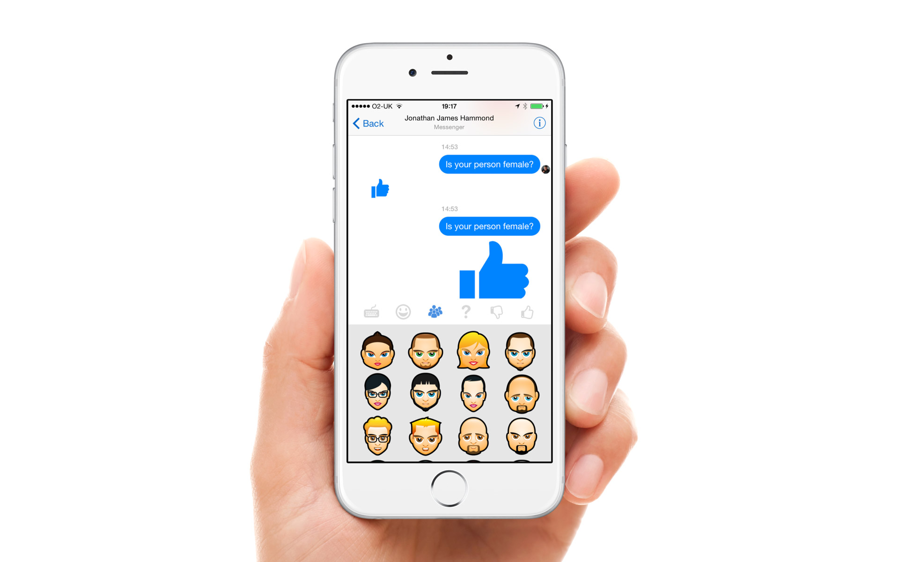
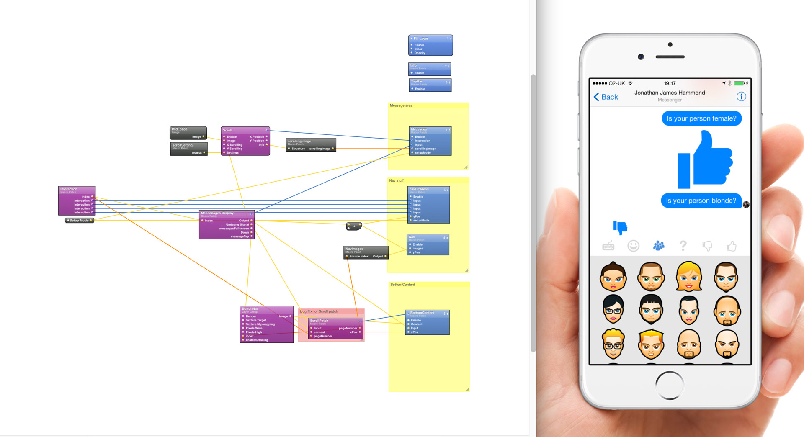

# Origami-GuessWho
Guess Who Prototype for the Messenger Platform, built in Origami and Quartz Composer

===========

More example found at http://www.justaddmusicmedia.com/work/prototypes/

Tutorial composition on builting pop animation like in facebooks messenger application for ios, built with the prototyping tool Origami (by Facebook)

I did not create the face graphics if you know where they are from please contact me so I can give credit to the original creator.
Email me if you use this composition would be great to check out your work. Have fun learning QC and Origami

Facebook Community discussion and video
https://vimeo.com/124323243

## Features
- Message scrolling on the vertical axis
- Sub menu pop animation
- Sub menu scrolling on the vertical axis
- Sub menu scrolling on the horizonal axis
- Logic and conditionals for menu selection

## How to Use
- Clone this repo
- Open the QC folder
- Open the **.qc files**
- Have fun!

## Dependencies
Requires [Quartz Composer](https://developer.apple.com/downloads/download.action?path=Developer_Tools%2Fgraphics_tools_for_xcode__xcode_6.1%2Fgraphicstools_for_xcode_6.1.dmg "Quartz Composer") and [Origami](http://facebook.github.io/origami/download/ "Origami") 

## Known Issues

